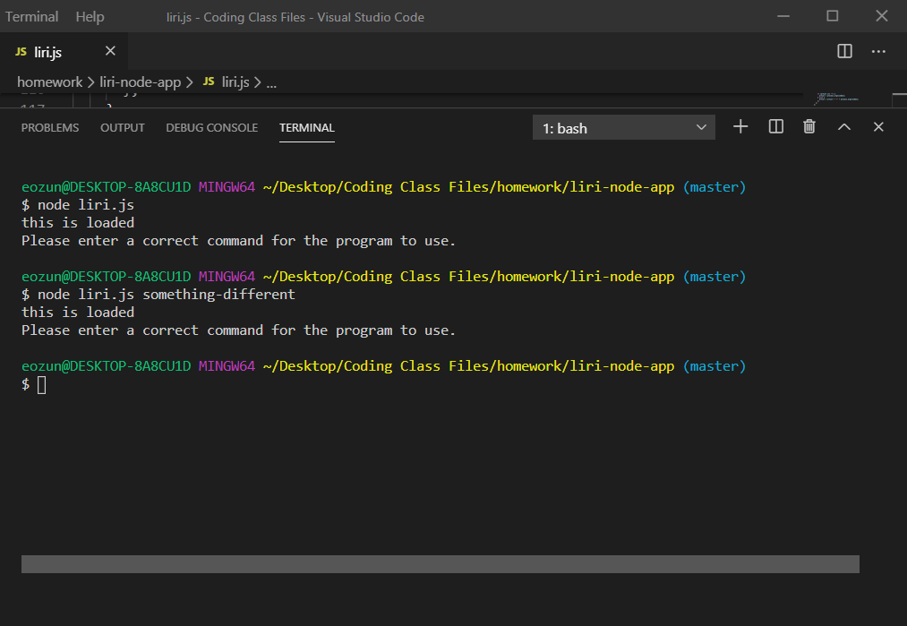
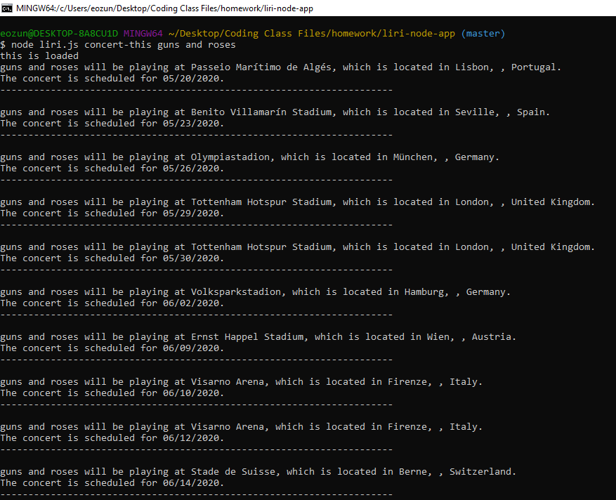
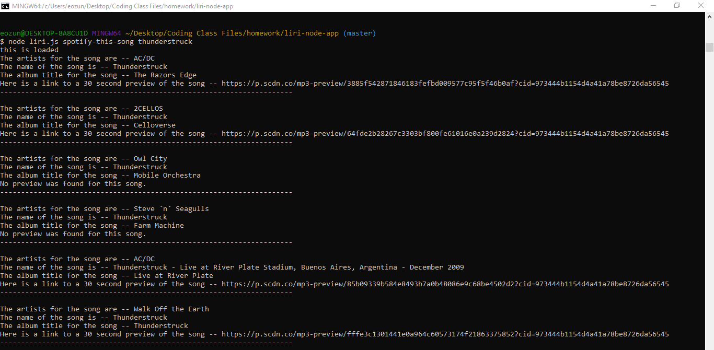
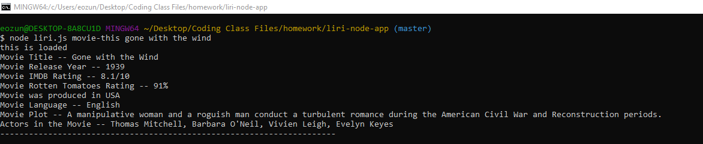

# liri-node-app (First node application)

### Overview
This application is a command line node app that takes in series of arguments and based on the first arguement passed decides what type of information to return.  The app uses the rest of the arguments passed to send requests to several node modules to retrieve the required information.  This application is my first use of node with command-line interface.

### How the application is organized
The first part of application involves requiring access to all of the previously installed modules for use in the application along with creating a global variable which is assigned the value of the first argument passed in command line.  

Next a series of 3 functions were created to use the node modules along with the remaining command line arguments to perform API calls and retrieve the required information.  The functions also renders the returned information to the terminal window.  The first function performs a Bands in Town API call, the second function performs an OMDB API call, and the final function performs a Spotify API call.

Next a switch statement is used to determine which function to call based on the first argument passed from the command line.  The last case of the switch statement involves using the node file system module to pull information from a text file and then use the information from the text file as arguments for a 2nd switch statement which will call one of the previous functions.

### Technologies used in the application
1.  Javascript
2.  Node.js
3.  Axios Node Module
4.  Node-Spotify-API Module
5.  Moment Module
6.  DotEnv Module

## Instructions for use of the application
### Before using the app
Before you can start to use the app you will need to install a few of the modules listed below.  To install each of the modules, type in the code below on the command line for each module replacing "module name" with the actual name of the module.

`$ npm install <Module Name>`

Here are list of modules you need and links to each to reference to:
* [Node-Spotify-API](https://www.npmjs.com/package/node-spotify-api)
* [Axios](https://www.npmjs.com/package/axios) - You will use this module to grab data from the [OMDB API](http://www.omdbapi.com/) and the [Bands In Town API](http://www.artists.bandsintown.com/bandsintown-api)

* [Moment](https://www.npmjs.com/package/moment)
* [DotEnv](https://www.npmjs.com/package/dotenv)

### Running the application
To start the application you will need to type in the following code into the command line terminal.

`$ node liri.js <command-selection> <artist name/song name/movie name here>`

#### What are the Command Selections
The `<command-selection>` choices are as follows:
  - `concert-this`
  - `spotify-this-song`
  - `movie-this`
  - `do-what-it-says`

  If no command selection is given or a command is given that is not one  of the above for then a generic response is output to the terminal as noted below in the screen shot:

  

#### How to use command selections along with the other arguements passed
The `concert-this` command uses the given artists name that follows the command selection, and then performs an API call to the Bands in Town API.  It then retrieves information about upcoming concerts for the given artist and then outputs to the terminal 

  - Name of the venue
  - Venue location
  - Date of the 
  
  `concert-this`example: `$ node liri.js concert-this guns and roses`

  

The `spotify-this-song` command uses the given songs title that follows the command selection, and then performs an API call to the Spotify API.  It retrieves the information about the song from Spotify and then outputs to the terminal

  - The Artist(s) that performed the song
  - The song's name
  - A preview link of the song from Spotify
  - The album that the song is 
  
  `spotify-this-song`example: `$ node liri.js spotify-this-song thunderstruck`

  

The `movie-this` command uses the given movie title that follows the command selection, and then performs an API call to the OMDB API.  It retrieves the information about the movie from the OMDB site and the outputs to the terminal

  - Title of the movie.
  - Year the movie came out.
  - IMDB Rating of the movie.
  - Rotten Tomatoes Rating of the movie.
  - Country where the movie was produced.
  - Language of the movie.
  - Plot of the movie.
  - Actors in the movie

  `movie-this` example: `$ node liri.js movie-this gone with the wind`

  

The `do-what-it-says` command uses the node file system to pull information placed in a random.txt file.  The information place in this file is one of the other command selections followed by the appropriate song/movie/artist selection.  Based on this information in random.txt file it excutes one of the other commands and outputs the appropriate information to the terminal.

## Links
1.  Link to git hub repository for this app:  [Github Link](https://github.com/eozuna3/liri-node-app/blob/master/liri.js)
2.  